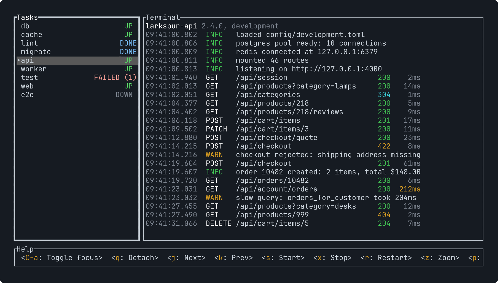
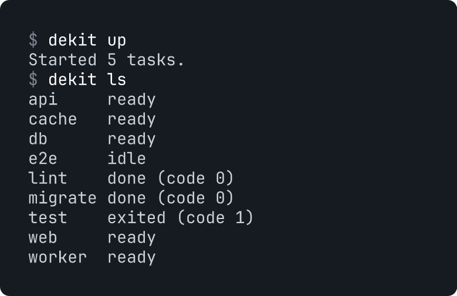

<h1 align="center">dekit</h1>

<p align="center"><b>Process manager for dev and prod</b></p>

<p align="center">
  <a href="https://dekit.run/docs"></a>
  <a href="https://x.com/pavelvolok"></a>
</p>

**dekit is a process manager.** It runs your project's tasks, such as servers,
databases and workers, in development and in production.

- Define your project's tasks in a config file
- dekit handles dependencies, crashes and restarts
- Watch and control tasks in a terminal UI
- A full CLI for humans and agents
- Built-in JavaScript for writing scripts



## Install

macOS, Linux:

```sh
curl -fsSL https://dekit.run/install.sh | sh
```

Windows (PowerShell):

```powershell
irm https://dekit.run/install.ps1 | iex
```

## Quick start

`dekit.yaml` at the project root:

```yaml
tasks:
  db:
    cmd: ["postgres", "-D", ".data/db"]
    ready: { log: "ready to accept connections" }
  api:
    cmd: ["cargo", "run", "-p", "api"]
    deps: [db]
    autostart: true
```

```sh
dekit up        # start the runner and the autostart tasks
dekit ls        # see what is running
dekit attach    # open the terminal UI
dekit down      # stop for the day; `dekit up` brings everything back
```



The tasks keep running after you close the terminal. `dekit help` shows the
docs in your terminal.

## Coming from mprocs

dekit is the next version of [mprocs](README-mprocs.md). `dekit mprocs` runs
your `mprocs.yaml` with the same flags and keys. See
[Coming from mprocs](https://dekit.run/docs/start/from-mprocs) to switch to
`dekit.yaml`.

## Updates

Follow [@pavelvolok](https://x.com/pavelvolok) on X for news about dekit.

## License

MIT
